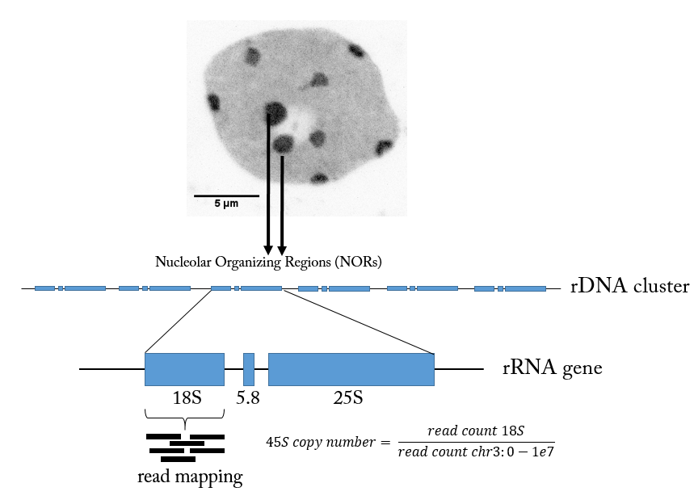

# rDNA_copy_number
Pipeline to assess the number of rDNA copies from Arabidopsis thaliana based on short reads


# Introduction
The copy number of 45S rRNA genes is assessed using by calculating the coverage of reads mapped at 18S sequence (chr3:14197677..14199484) and at the first 10 Mb of the chromosome 3 (chr3:0..10000000). The mapping is performed therefore in 2 times using bwa mem algorithm to map and samtools flagstat to retrieve the mapped read number. The number of reads in both region is divided by the size of the mapped regions (1808 bp and 10Mb, respectively). This provides an average number of reads per base pair. The ratio of the average read number/bp between 18S and chr3 provides the the estimated copy number of the 45S gene (18S being a good proxy of 45S copies according to Rabanal et al., 2017 G3).


# Required softwares

* bwa (v0.7.15)
* bedtools (v2.25.0)
* R (v3.5.0)
* fastq-dump (v2.9.2)

# Step-by-step

For *Arabidopsis thaliana*, the 45S region is located at position `chr3:14195483..14204860` (TAIR10 assembly). The subregion 18S is located at position `chr3:14197677..14199484` (TAIR10 assembly). The first 10 Mb of chromosome 3 is used for normalization (chr3:0..10000000). One need to first generate bwa indexes for 45S fasta and chr3 10Mb fasta sequences. The reads are mapped to the whole 45S sequence but only the reads mapping at the 18S subsequence are counted. This way, overlapping reads are still present while they would have not mapped if the 18S was used as reference for mapping and counting.

The pipeline is:
* Map reads to 45S
* Map reads to the first 10Mb of chromosome 3
* Count the total number of reads mapping on the 18S part of the 45S
* Count the total number of reads mapping on the first 10Mb of the chromosome 3
* Normalize the count of reads on 18S by the count of reads on the 10Mb of chromosome 3 which provides an estimate of the number of 45S copies
* Plot data in R


Here a cartoon of the summary



## Generate BWA indexes


Download TAIR10 fasta file from [here](https://arabidopsis.org/download_files/Genes/TAIR10_genome_release/TAIR10_chromosome_files/TAIR10_chr_all.fas).


Replace simple chromosome number by chrX system:

```{bash}
sed -i 's/>\([1-5]\)/>chr\1/' TAIR10_chr_all.fas
```

Extract the 2 regions of interest:

```{bash}
# Create 2 bed files with chr3 and 45S coordinates

echo -e "chr3\t0\t10000000" > chr3_0_10Mb.bed
echo -e "chr3\t14195483\t14204860" > 45S.bed

bedtools getfasta -fi TAIR10_chr_all.fas -bed chr3_0_10Mb.bed -fo chr3_0_10Mb.fa
bedtools getfasta -fi TAIR10_chr_all.fas -bed 45S.bed -fo 45S.fa
```

Index these 2 files with bwa

```{bash}
bwa index -p chr3_bwaidx -a bwtsw chr3_0_10Mb.fa
bwa index -p 45S_bwaidx -a bwtsw 45S.fa
```

The bed, fasta, and indexes files were already generated and are located in [bwa_indexes](./bwa_indexes).
The `TAIR10_chr_all.fas` was deleted as it takes about 116 Mb.


## Mapping reads

The script [mapping_bwa.sh](mapping_bwa.sh) maps the reads from single or paired-end data and generates a bam file with aligned reads. Four threads are chosen by default for bwa alignment but one can modify the argument `-t 4` and change the default value.


For instance:

```{bash}

bash mapping_bwa.sh -1 

```
